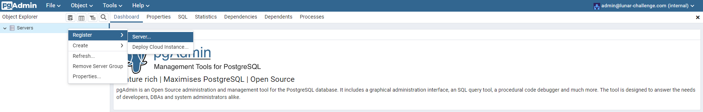
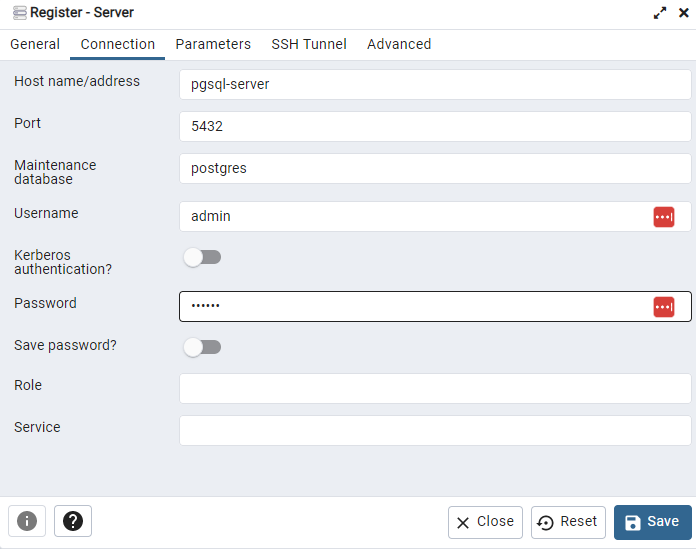

# Lunar Rocket Launcher

- [Introduction](#introduction)
- [Features](#features)
- [Prerequisites](#prerequisites)
- [Installation](#installation)
- [Usage](#usage)
  - [Start Docker](#start-docker)
  - [Start the Flask App](#start-the-flask-app)
  - [Launch Rockets](#launch-rockets)
- [Accessing Data with Kafka](#accessing-data-from-kafka)
  - [Kafka via Command Line](#kafka-via-command-line)
  - [Kafka via KSQL](#kafka-via-ksql)
- [Accessing Data with PostgreSQL](#accessing-data-from-postgresql)
  - [PostgreSQL via Command Line](#postgresql-via-command-line)
  - [Accessing Data via pgAdmin](#accessing-data-via-pgadmin)
- [Assumptions](#assumptions)
- [License](#license)
- [Acknowledgments](#acknowledgments)

## Introduction

This application aims to consume a service and ingest the events produced by it.
The data is being ingested in two tools: a Kafka topic and a PostgreSQL database.

## Features
- Receives launch data packages through a POST request to the /messages endpoint.
- Uses KafkaConsumer to consume messages from a Kafka topic named `rocket-launch`.
- Stores the received data in a PostgreSQL database named `rocket_data`.
- Supports different types of launch messages: RocketLaunched, RocketSpeedIncreased, RocketSpeedDecreased, RocketExploded, and RocketMissionChanged.

## Prerequisites
Before running the application, make sure you have the following components installed:

- Python (version 3.6 or above)
- Docker (version 20.10.23 or above)
- Docker compose (version 2.15.1 or above).

## Installation
1. Clone the repository:
```bash
git clone https://github.com/marcellohmartins/lunar-challenge
cd lunar-challenge
```

2. Install requirements:
```bash
pip install -r requirements.txt
```

## Usage

1. Start the Docker to build the container with Kafka, PostgreSQL and the PostgreSQL Admin:
```bash
docker-compose --env-file .env up -d
```
The --env-file is important since we have some variables in .env that are needed to build everything correctly.

2. Start the Flask app. For that you just need to run `app.py`

3. The rockets.exe can be launched. As it is a POC the `app.run()` is build for HTTP.
```bash
./rockets launch "http://localhost:8088/messages" --message-delay=500ms --concurrency-level=1
```

The data will start to get into a Kafka topic and in PostgreSQL.

## Accessing Data with Kafka

### Kafka via command line

The data is being added in a topic called `rocket-launch`. To read the data in the topic from beginning it is possible to use:
```bash
docker exec --interactive --tty broker kafka-console-consumer --bootstrap-server broker:9092 --topic rocket-launch --from-beginning
```

### Kafka via KSQL

First it is needed to open the ksqldb shell:

```bash
docker exec -it ksqldb-cli-2 sh
```

Then execute ksql inside it:

```shell
ksql http://ksqldb-server:8090
```

If data was added to the `rocket-launch` topic, we will be able to see the topic there with the command:
```shell
SHOW TOPICS;
```

To query data in a specific topic it is needed to create a KSQL stream or a table based on the topic. For example:

```SQL
CREATE STREAM myStream (
  metadata STRUCT<
    channel VARCHAR(36),
    messageNumber INT,
    messageTime STRING,
    messageType VARCHAR(80)
  >,
  message STRUCT<
    type VARCHAR(80),
    launchSpeed INT,
    mission VARCHAR(80),
    `by` INT,
    reason VARCHAR(80),
    newMission VARCHAR(80)
  >
) WITH (
  KAFKA_TOPIC='rocket-launch',
  VALUE_FORMAT='JSON'
);
```

From here it is possible to do queries or create tables.

## Accessing Data with PostgreSQL

The data is added in a Database called `rocket_data`, and 4 different tables:
- rocket_launched: receives data with messageType `RocketLaunch`;
- speed_change: receives data with messageType `RocketSpeedIncreased` and `RocketSpeedDecreased`;
- rocket_exploded: receives data with messageType `RocketExploded`;
- mission_changed: receives data with messageType `RocketMissionChanged`.

The `metadata` is stored for all kinds of data. The `message` changes.
Then, if we have one channel for each mission, we can join tables with this field as key.
Also, for the speed increase or decrease, as the data are in same table, it is possible to do a condition, for example:
```sql
CASE
WHEN messageType = 'RocketSpeedIncreased'
THEN changeValue
WHEN messageType = 'RocketSpeedDecreased'
THEN changeValue*-1
END AS speed
```

### PostgreSQL via command line:

With the command:
```bash
docker exec -it postgres psql -U admin -d rocket_data
```
It is possible to access the database rocket_data.
Then with
```bash
\dt
```
It is possible to see the tables. 
From this point queries can be done. Don't forget `;` in the end, here it is obligatory. For example:
```sql
SELECT * FROM rocket_launched LIMIT 10;
```


### How to access this tables via PostgresAdmin:

The `docker-compose` is building a pgAdmin page.
You can access it with via `localhost:8080`.
The admin and password are being defined in docker-compose, they are:
login: admin@lunar-challenge.com
password: secret

Then it is needed to create a server. The steps are:

- Right click `Servers` and go to `Register` and then `Server`:



- In `General` you can choose a name, for example "my_server", and click on `Connection`.
Here it is needed to fill:
  - Host name: pgsql-server
  - Username: admin
  - Password: secret



- In the created server > Databases > rocket_data > Schemas > public > Tables it is possible to see the tables with the produced data.
Now it is possible to query the tables with a UI.

## Assumptions 
- For test as the certificates and keys are not available, instead it was used HTTP requests for receiving the messages.
- Some secrets are in .env, docker-compose or even in the readme.md. This is an awful practice, but as the aim is this test to be reproducible, this was made.
In a production environment it is possible to use a vault or some cloud tool with python APIs, for example, the AWS Secrets Manager.
- How and where the data should be depends on the use, so for POC cases, it was decided to add raw data in Kafka and different tables in PostgreSQL.
- Another ways to consume from kafka was: Kafka Consumer library to Python, Kafka Connects to PostgreSQL, for example, built with docker-compose.

## License
This project is licensed under the [MIT License](https://opensource.org/license/mit/).

## Acknowledgments
- [Flask](https://flask.palletsprojects.com/en/2.3.x/)
- [Kafka](https://kafka.apache.org/)
- [Psycopg](https://www.psycopg.org/docs/)
- [Docker](https://www.docker.com/)
- [KSQL](https://docs.ksqldb.io/en/latest/)
